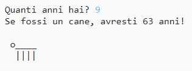

\--- challenge \---

## Sfida: La tua età in anni canini

Scrivi un programma in cui chiedi all’utilizzatore la sua età e poi gli dici la sua età in anni canini! Puoi calcolare l’età di una persona in anni canini moltiplicando la loro età per 7.

In programmazione, il simbolo della moltiplicazione è l’asterisco (*) che trovi, in una tastiera Windows, nell’ultimo tasto a destra della seconda fila di tasti dall’alto, accanto a Invio.

\--- /challenge \---