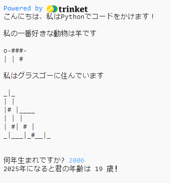

## はじめに

このプロジェクトでは、あなたのすべてのことを伝えるPythonプログラムを書く方法を学びます。

### あなたが作るもの

  <iframe src="https://trinket.io/embed/python/a1f663ae0d?outputOnly=true&start=result" width="600" height="500" frameborder="0" marginwidth="0" marginheight="0" allowfullscreen>
  </iframe>
  

### あなたが学ぶもの

このプロジェクトは、 [Raspberry Pi Digital Making Curriculum](http://rpf.io/curriculum){：target = "_ blank"}の次の要素から構成されています。

+ [基本的なプログラミング構造を使用して簡単なプログラムを作成する](https://www.raspberrypi.org/curriculum/programming/creator){：target = "_ blank"}

### 教育者のための追加情報

このプロジェクトを印刷する必要がある場合は、 [印刷用バージョン](https://projects.raspberrypi.org/en/projects/about-me/print){：target = "_ blank"}を使用してください。

フッターのリンクを使用して、このプロジェクトのGitHubリポジトリにアクセスします。このリポジトリには、 'en / resources'フォルダ内のすべてのリソース（完成プロジェクトの例を含む）が含まれています。