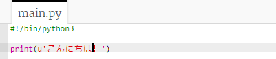
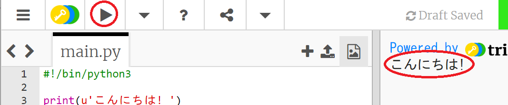
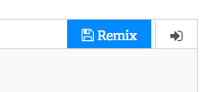

## 挨拶

テキストを書くことから始めましょう。

+ 空白のPythonテンプレートを開きます。 <a href="http://jumpto.cc/python-new" target="_blank">jumpto.cc/python-new</a>。

+ 表示されるウィンドウに次のように入力します。
    
    
    
    `＃！/ bin / python3` 行は、私たちがPython 3（最新バージョン）を使用していることをTrinketに伝えるだけです。

+ **Run**をクリックすると、 `print（）` コマンドが、引用符 `'' `の間のすべてを出力することがわかります。日本語を表示するためには''の前にuをたす必要があります。忘れるとバグが発生します。
    
    

間違えた場合は、何が間違っているかを伝えるエラーメッセージが表示されます。

+ それを試してみてください！ 最後の引用符 （`'`） またはブラケット`）` を削除してください （またはその両方）。何が起きるかを確認してください。
    
    

+ 見積もりまたはブラケットを再度追加し、**Run** をクリックして 、プロジェクトが再び機能することを確認します。

**あなたのプロジェクトを保存するためにTrinketアカウントは必要ありません！**

小銭入れ口座を持っていない場合は、下矢印をクリックして、 **リンク**をクリックしてください。 これにより、保存して後で戻ってくることができるリンクが得られます。 リンクが変更されるため、変更するたびにこれを行う必要があります。

あなたがTrinketアカウントを持っている場合は、 **Remix** をクリックして、自分の小品のコピーを保存できます。

