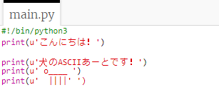
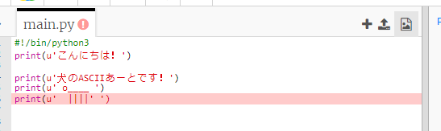
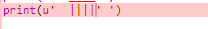
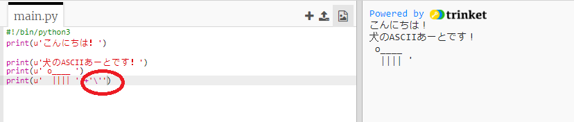
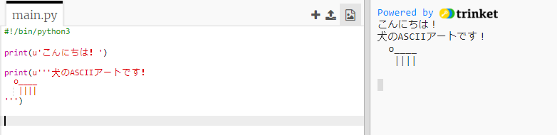

## ASCIIアート

テキストよりももっと楽しいものを表示しましょう：ASCIIアート！ ASCIIアート（「*ask-e*」と発音）とは **文字を使って作られた絵**のことです。

+ あなたのプログラムに作品を加えてみましょう - 犬の絵！
    
    

犬の足は、パイプ文字 `| 123_7_2_321 Shift + \ </kbd> を押して入力できます。ほとんどの英国/米国英語キーボードで入力できます。

<ul>
<li>
<strong>Run</strong>をクリックすると、新しいコードにバグがあることがわかります。

これは、テキストにアポストロフィ <code>'`が含まれているためです。これはPythonがテキストの終わりと考えるものです！

</li> 

+ これを修正するには、アポストロフィの前にバックスラッシュ `` を入れてください。 これは、アポストロフィがテキストの一部であることをPythonに伝えます。
    
    

+ 必要に応じて、3つのアポストロフィ `'''` を1つではなく使用して、1つの `print` ステートメントで複数行のテキストを表示することができます。
    
    </ul>