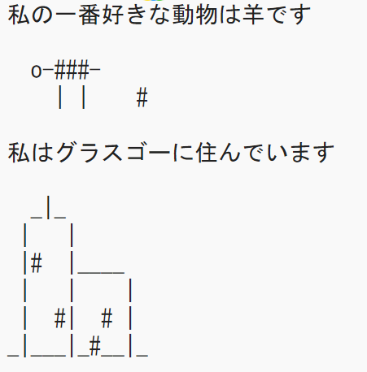

\--- challenge \---

## チャレンジ：あなた自身について

Pythonプログラムを書いて、テキストやASCIIアートを使って自分のことを他人に伝えます。 趣味、友達、または好きなものの画像を作成することができます！

**Trinketで書いたコードは公開されています。 あなたの氏名や住所などの個人情報を共有しないでください！**

ここに例があります：

\--- challenge \---