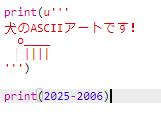
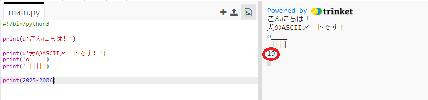
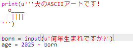
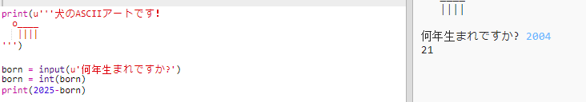
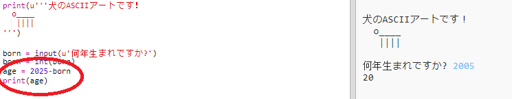
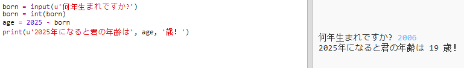

## 2025年

計算や数値も表示できます。 2025年に何歳になるのかを見てみましょう！

+ あなたが2025年になる年齢を計算するには、あなたが2025年から生まれた年を引く必要があります。
    
    このコードをプログラムに追加します：
    
    
    
    数字の周りに引用符を付ける必要がないことに注意してください。 （別の年に生まれた場合は、 `2006` 部分の数字を変更する必要があります）。

+ **Run**をクリックすると、プログラムは2025年の年齢を出力します。
    
    

+ `input（）` を使用してユーザーに年齢を問い合わせ、 **変数** （ `born`）に格納してプログラムを改善できます。
    
    

+ あなたのプログラムを実行し、あなたが生まれた年を入力してください。 Did you get another error message?
    
    エラーが発生したのは、プログラムに入力されたものが **テキスト**であり、 **数値**に変換する必要があるためです。
    
    `int（）` を使用して、テキストを **整数値**に変換できます。 整数値とは0から順に一ずつ増すか減らすかすることによってできる数です。
    
    

+ また、計算を保存する別の変数を作成して代わりに表示することもできます。
    
    

+ 最後に、役に立つメッセージを追加することで、プログラムを理解しやすくすることができます。
    
    