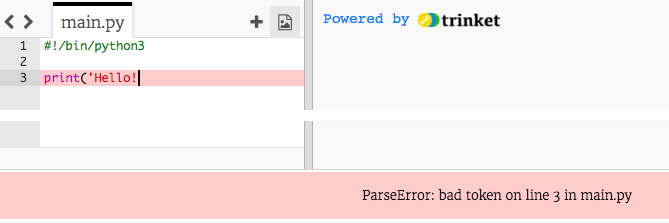

## ಹಲೋ ಹೇಳುವುದು

ಕೆಲವು ಪಠ್ಯವನ್ನು ಬರೆಯುವ ಮೂಲಕ ಪ್ರಾರಂಭಿಸೋಣ.

+ ಖಾಲಿ ಪೈಥಾನ್(Python) ಟ್ರಿಂಕೆಟ್(Trinket) ಟೆಂಪ್ಲೆಟ್(ಮಾದರಿತೋರಕ): <a href="http://jumpto.cc/python-new" target="_blank">jumpto.cc/python-new</a>ಅನ್ನು ತೆರೆಯಿರಿ.

+ ಗೋಚರಿಸುವ ವಿಂಡೋದಲ್ಲಿ, ಕೆಳಗಿನವುಗಳನ್ನು ಟೈಪ್ ಮಾಡಿ:
    
    
    
    ಈ ಸಾಲು ` #! /bin /python3 ` ನಾವು Python 3 (ಇತ್ತೀಚಿನ ಆವೃತ್ತಿ) ಬಳಸುತ್ತಿದ್ದೇವೆ ಎಂದು ಟ್ರಿಂಕೆಟ್ ಗೆ(Trinket) ಹೇಳುತ್ತದೆ.

+ **Run**ಕ್ಲಿಕ್ ಮಾಡಿ, ನಂತರ `print()` ಆಜ್ಞೆಯು ಉದ್ಧರಣ ಚಿಹ್ನೆಗಳ `''` ನಡುವೆ ಎಲ್ಲವನ್ನೂ ಮುದ್ರಿಸುತ್ತದೆ.
    
    

ನೀವು ತಪ್ಪು ಮಾಡಿದ್ದರೆ, ಬದಲಿಗೆ ಏನು ತಪ್ಪಾಗಿದೆ ಎಂದು ಹೇಳುವ ದೋಷ ಸಂದೇಶವನ್ನು ನೀವು ಪಡೆಯುತ್ತೀರಿ!

+ ಪ್ರಯತ್ನಿಸಿ ನೋಡಿ! ಅಂತಿಮ ಉಲ್ಲೇಖವನ್ನೋ ` ' `ಅಥವಾ ಮುಚ್ಚುವ ಆವರಣವನ್ನೋ `)` (ಅಥವಾ ಎರಡೂ) ಅಳಿಸಿ ನಂತರ ಏನಾಗುತ್ತದೆ ಎಂದು ನೋಡಿ.
    
    

+ ಉಲ್ಲೇಖ ಅಥವಾ ಬ್ರಾಕೆಟ್ ಅನ್ನು ಪುನಃ ಸೇರಿಸಿ, ಮತ್ತು ** Run** ಕ್ಲಿಕ್ ಮಾಡಿ ನಿಮ್ಮ ಪ್ರಾಜೆಕ್ಟ್(ಯೋಜನೆ) ಮತ್ತೆ ಕಾರ್ಯನಿರ್ವಹಿಸುತ್ತದೆಯೇ ಎಂದು ಖಚಿತಪಡಿಸಿಕೊಳ್ಳಲು.

**ನಿಮ್ಮ ಯೋಜನೆಗಳನ್ನು ಉಳಿಸಲು ನಿಮಗೆ ಟ್ರಿಂಕೆಟ್(Trinket) ಖಾತೆಯ ಅವಶ್ಯಕತೆ ಇಲ್ಲಾ!**

ನೀವು ಟ್ರಿಂಕೆಟ್(Trinket) ಖಾತೆಯನ್ನು ಹೊಂದಿಲ್ಲದಿದ್ದರೆ, ಕೆಳಗಿನ ಬಾಣದ ಗುರುತನ್ನು ಕ್ಲಿಕ್ ಮಾಡಿ ಮತ್ತು ನಂತರ **ಲಿಂಕ್**ಕ್ಲಿಕ್ ಮಾಡಿ. ಇದು ನಿಮಗೆ ಉಳಿಸಬಹುದಾದ(ಸೇವ್ ಮಾಡುವ) ಲಿಂಕ್ ಅನ್ನು ನೀಡುತ್ತದೆ ಮತ್ತು ನಂತರ ಹಿಂತಿರುಗಬಹುದು. ಲಿಂಕ್ ಬದಲಾದಂತೆ, ನೀವು ಬದಲಾವಣೆಗಳನ್ನು ಮಾಡಿದಾಗ ನೀವು ಇದನ್ನು ಪ್ರತಿ ಬಾರಿ ಮಾಡಬೇಕಾಗುತ್ತದೆ!

ನೀವು ಟ್ರಿಂಕೆಟ್(Trinket) ಖಾತೆಯನ್ನು ಹೊಂದಿದ್ದರೆ, ನಿಮ್ಮ ಸ್ವಂತ ಟ್ರಿಂಕೆಟ್‌ನ(trinket) ನಕಲನ್ನು ಉಳಿಸಲು ನೀವು **Remix** ಕ್ಲಿಕ್ ಮಾಡಬಹುದು.

