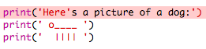

## ಆಸ್ಕೀ(ASCII) ಕಲೆ

ಪಠ್ಯಕ್ಕಿಂತ ಹೆಚ್ಚು ಮೋಜಿನ ಸಂಗತಿಯನ್ನು ಮುದ್ರಿಸೋಣ: ಆಸ್ಕೀ(ASCII) ಕಲೆ! ಆಸ್ಕೀ(ASCII) ಕಲೆಯು('* ಆಸ್ಕ್-ಈ(ask-e)*'ಎಂದು ಉಚ್ಚರಿಸಲಾಗುತ್ತದೆ)**ಪಠ್ಯದ ಹೊರಗಿನ ಚಿತ್ರಗಳನ್ನು** ರಚಿಸುತ್ತಿದೆ.

+ ನಿಮ್ಮ ಕಾರ್ಯಕ್ರಮಕ್ಕೆ(ಪ್ರೋಗ್ರಾಮ್ ಗೆ) ಕೆಲವು ಕಲೆಗಳನ್ನು ಸೇರಿಸೋಣ - ನಾಯಿಯ ಚಿತ್ರ!
    
    

ನಾಯಿಯ ಕಾಲುಗಳನ್ನು ಪೈಪ್ ಅಕ್ಷರ ` | ` ಬಳಸಿ ತಯಾರಿಸಲಾಗುತ್ತದೆ, ಇದನ್ನು ನೀವು ಹೆಚ್ಚಿನ ಯುಕೆ(UK) / ಯುಎಸ್(USA) ಆಂಗ್ಲ(ಇಂಗ್ಲಿಷ್) ಕೀಬೋರ್ಡ್‌ಗಳಲ್ಲಿ <kbd> Shift+ \ </kbd> ಒತ್ತುವ ಮೂಲಕ ಟೈಪ್ ಮಾಡಬಹುದು.

+ ನೀವು **Run** ಕ್ಲಿಕ್ ಮಾಡಿದರೆ, ನಿಮ್ಮ ಹೊಸ ಕೋಡ್‌ನಲ್ಲಿ ದೋಷವಿದೆ ಎಂದು ನೀವು ನೋಡುತ್ತೀರಿ.
    
    
    
    ನಿಮ್ಮ ಪಠ್ಯವು ಸಂಭೋಧನಾ ಚಿಹ್ನೆಯನ್ನು (ಅಪಾಸ್ಟ್ರಫಿ)`'` ಒಳಗೊಂಡಿರುವುದರಿಂದ, ಪಠ್ಯದ ಅಂತ್ಯ ಎಂದು ಪೈಥಾನ್(Python) ಭಾವಿಸುತ್ತಾನೆ!
    
    

+ ಇದನ್ನು ಸರಿಪಡಿಸಲು, `here's` ಪದದಲ್ಲಿ ಸಂಭೋಧನಾ ಚಿಹ್ನೆಗೆ(ಅಪಾಸ್ಟ್ರಫಿಗೆ) ಮೊದಲು ಬ್ಯಾಕ್ಸ್‌ಲ್ಯಾಶ್ ` \ ` ಅನ್ನು ಸೇರಿಸಿ. ಸಂಭೋಧನಾ ಚಿಹ್ನೆಯು(ಅಪಾಸ್ಟ್ರಫಿ) ಪಠ್ಯದ ಭಾಗವಾಗಿದೆ ಎಂದು ಇದು ಪೈಥಾನ್ ಗೆ(Python) ಹೇಳುತ್ತದೆ.
    
    

+ ನೀವು ಬಯಸಿದರೆ, ನೀವು ಒಂದರ ಬದಲು ಮೂರು ಸಂಭೋಧನಾ ಚಿಹ್ನೆಗಳನ್ನು ಬಳಸಬಹುದು `'''`, ಇದು ಒಂದು ` print` ಹೇಳಿಕೆಯೊಂದಿಗೆ ಅನೇಕ ಸಾಲುಗಳ ಪಠ್ಯವನ್ನು ಮುದ್ರಿಸಲು ನಿಮಗೆ ಅನುಮತಿಸುತ್ತದೆ:
    
    