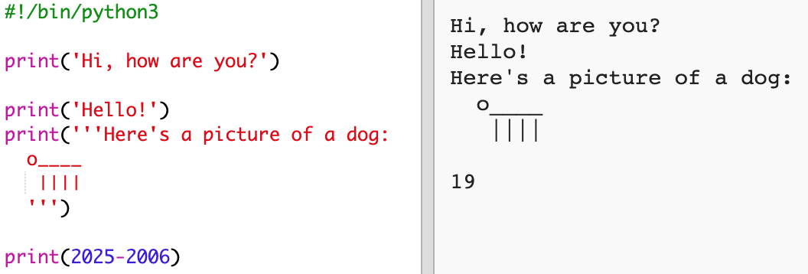

## ವರ್ಷ 2025

ನೀವು ಲೆಕ್ಕಾಚಾರಗಳನ್ನು ಮತ್ತು ಸಂಖ್ಯೆಗಳ ಮುದ್ರಣವನ್ನು ಸಹ ಮಾಡಬಹುದು. ನಿಮ್ಮ ವಯಸ್ಸು 2025 ರಲ್ಲಿ ಎಷ್ಟಿರಬಹುದೆಂದು ಕಂಡುಹಿಡಿಯೋಣ!

+ 2025 ರಲ್ಲಿ ನೀವು ಎಷ್ಟು ವಯಸ್ಸಾಗಿರುತ್ತೀರಿ ಎಂದು ಲೆಕ್ಕಹಾಕಲು, ನೀವು 2025 ರಿಂದ ಜನಿಸಿದ ವರ್ಷವನ್ನು ಕಳೆಯಬೇಕು.
    
    ನಿಮ್ಮ ಪ್ರೋಗ್ರಾಂಗೆ ಈ ಕೋಡ್ ಸೇರಿಸಿ:
    
    
    
    ನೀವು ಸಂಖ್ಯೆಗಳ ಸುತ್ತ ಉಲ್ಲೇಖಗಳನ್ನು (') ಹಾಕುವ ಅಗತ್ಯವಿಲ್ಲ ಎಂಬುದನ್ನು ಗಮನಿಸಿ. (ನೀವು ಬೇರೆ ವರ್ಷದಲ್ಲಿ ಜನಿಸಿದರೆ `2006` ಸಂಖ್ಯೆಯನ್ನು ಬದಲಾಯಿಸಬೇಕಾಗುತ್ತದೆ.)

+ **Run** ಕ್ಲಿಕ್ ಮಾಡಿ, ಮತ್ತು ನಿಮ್ಮ ಪ್ರೋಗ್ರಾಂ ನಿಮ್ಮ 2025 ರ ವಯಸ್ಸನ್ನು ಮುದ್ರಿಸಬೇಕು.
    
    

+ ನೀವು `input()` ಅನ್ನು ಬಳಸುವ ಮೂಲಕ ನಿಮ್ಮ ಪ್ರೋಗ್ರಾಂ ಅನ್ನು ಸುಧಾರಿಸಬಹುದು ಅದು ಹೇಗೆಂದರೆ ಬಳಕೆದಾರರಿಗೆ ತಮ್ಮ ವಯಸ್ಸನ್ನು ಕೇಳುವುದು ಮತ್ತು ಅದನ್ನು `born` ಯಂಬ **ಅಸ್ಥಿರ ಪದ(ವೇರಿಯಬಲ್)** ದಲ್ಲಿ ಸಂಗ್ರಹಿಸುವುದರಿಂದ.
    
    

+ ನಿಮ್ಮ ಪ್ರೋಗ್ರಾಂ ಅನ್ನು ರನ್(Run) ಮಾಡಿ ಮತ್ತು ನಂತರ ನೀವು ಹುಟ್ಟಿದ ವರ್ಷವನ್ನು ನಮೂದಿಸಿ. ನಿಮಗೆ ಇನ್ನೊಂದು ದೋಷ ಸಂದೇಶ ಬಂದಿದೆಯೇ?
    
    ಏಕೆಂದರೆ ನಿಮ್ಮ ಪ್ರೋಗ್ರಾಂನಲ್ಲಿ ಏನೇ ಟೈಪ್ ಮಾಡಿದರು ಅದು **ಪಠ್ಯ** ದಲ್ಲಿರುತ್ತದೆ ಮತ್ತು ಅದನ್ನು **ಸಂಖ್ಯೆ** ಗೆ ಪರಿವರ್ತಿಸುವ ಅಗತ್ಯವಿದೆ.
    
    ನೀವು `int()` ಅನ್ನು ಪಠ್ಯದಿಂದ **ಪೂರ್ಣಾಂಕಕ್ಕೆ(integer)** ಪರಿವರ್ತಿಸಲು ಬಳಸಬಹುದು. ಒಂದು ಪೂರ್ಣಾಂಕವು ಸಂಪೂರ್ಣ ಸಂಖ್ಯೆಯಾಗಿರುತ್ತದೆ.
    
    

+ ನಿಮ್ಮ ಲೆಕ್ಕಾಚಾರವನ್ನು ಸಂಗ್ರಹಿಸಲು ನೀವು ಇನ್ನೊಂದು ವೇರಿಯೇಬಲ್(ಅಸ್ಥಿರ ಪದ) ಅನ್ನು ಸಹ ರಚಿಸಬಹುದು ಮತ್ತು ಬದಲಿಗೆ ಅದನ್ನು ಮುದ್ರಿಸಬಹುದು.
    
    

+ ಅಂತಿಮವಾಗಿ, ನಿಮ್ಮ ಪ್ರೋಗ್ರಾಂ ಅನ್ನು ಸುಲಭವಾಗಿ ಅರ್ಥಮಾಡಿಕೊಳ್ಳಳು ಸಹಾಯಕ ಸಂದೇಶವನ್ನು ಸೇರಿಸಬಹುದು.
    
    