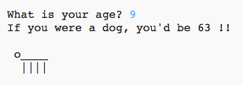

--- challenge ---

## ಸವಾಲು: ನಾಯಿ ವರ್ಷಗಳಲ್ಲಿ ನಿಮ್ಮ ವಯಸ್ಸು

ಬಳಕೆದಾರರಿಗೆ ಅವರ ವಯಸ್ಸನ್ನು ಕೇಳಲು ಪ್ರೋಗ್ರಾಂ ಬರೆಯಿರಿ, ತದನಂತರ ನಾಯಿ ವರ್ಷಗಳಲ್ಲಿ ಅವರ ವಯಸ್ಸನ್ನು ಅವರಿಗೆ ತಿಳಿಸಿ! ವ್ಯಕ್ತಿಯ ವಯಸ್ಸನ್ನು ನಾಯಿಯ ವರ್ಷಗಳಲ್ಲಿ ಲೆಕ್ಕ ಹಾಕಬೇಕಾದರೆ ಅವರ(ವ್ಯಕ್ತಿಯ) ವಯಸ್ಸನ್ನು 7 ರಿಂದ ಗುಣಿಸಿ.

ಪ್ರೋಗ್ರಾಮಿಂಗ್‌ನಲ್ಲಿ, **ಗುಣಾಕಾರ** (multiplication) ನ ಸಂಕೇತವು `*` ಅಕ್ಷರವಾಗಿದೆ, ಇದನ್ನು ನೀವು ಸಾಮಾನ್ಯವಾಗಿ ಕೀಬೋರ್ಡ್‌ನಲ್ಲಿ <kbd>Shift+ 8</kbd> ಒತ್ತುವ ಮೂಲಕ ಟೈಪ್ ಮಾಡಬಹುದು.

--- /challenge ---