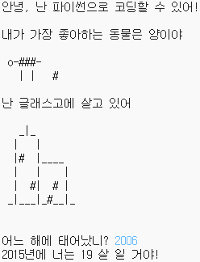

## 들어가며

이 프로젝트에서는 사람들에게 자신에 대해 전부 알려주는 Python 프로그램을 작성하는 방법을 배웁니다.

### 만들게 될 것

  <iframe src="https://trinket.io/embed/python/a1f663ae0d?outputOnly=true&start=result" width="600" height="500" frameborder="0" marginwidth="0" marginheight="0" allowfullscreen>
  </iframe>
  

### 배우게 될 것

이 프로젝트는 [라즈베리파이 디지털 메이킹 커리큘럼](http://rpf.io/curriculum) 중 아래의 과정에 있는 요소들을 다룹니다.

+ [ 기본 프로그래밍 구조를 사용하여 간단한 프로그램 작성 ](https://www.raspberrypi.org/curriculum/programming/creator) {: target = "_ blank"}

### 교육자를 위한 추가 정보

이 프로젝트를 인쇄하려면, [프린트용 버전](https://projects.raspberrypi.org/en/projects/about-me/print){:target="_blank"}을 사용하십시오.

아래쪽에 있는 이 프로젝트를 위한 GitHub repository 링크를 이용하세요. (완성된 프로젝트 예제를 포함한) 모든 리소스가 'en/resources' 폴더에 들어 있습니다.