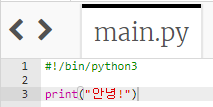
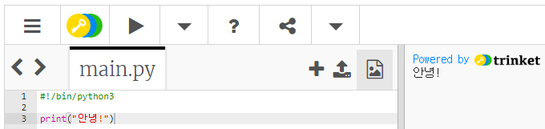

## 안녕하세요, 라고 말해보기

먼저 글자를 쓰는것으로 시작 해 봅시다.

+ 빈 파이썬 템플릿을 엽니다. <a href="http://jumpto.cc/python-new" target="_blank"> jumpto.cc/python-new </a>

+ 나타나는 창에 다음을 입력 해 보세요.
    
    
    
    `#!/bin/python3` 이라고 쓰여진 줄은 우리가 Python 3 (최신 버전) 을 사용하고 있다고 Trinket에게 알려줍니다.

+ **실행**을 클릭하면, `print()`명령이 따옴표`''`사이의 모든 것을 출력하는 것을 볼 수 있습니다.
    
    

만약 실수를 했다면, 무엇이 잘못되었는지 알려주는 에러 메세지를 볼 수 있습니다.

+ 한번 시도해 보세요! 닫히는 쪽의 따옴표 `'` 를 삭제하거나 닫는 괄호 `)` (또는 둘 다) 를 삭제하고 무슨 일이 일어나는 지 보세요.
    
    

+ 지웠던 따옴표나 괄호를 다시 써 주시고, **실행**을 클릭해서 당신의 프로젝트가 다시 작동하는지 확인 해 보세요.

**프로젝트를 저장하기 위해 Trinket 계정이 필요하지 않습니다!**

Trinket 계정이 없다면 아래쪽 화살표를 클릭 한 다음 **링크**를 클릭하십시오. 그러면 프로젝트를 저장 후 나중에 다시 볼 수 있는 링크가 제공됩니다. 변경사항이 생길 때 마다 링크를 클릭해서 새로운 링크를 만들 수 있습니다.

Trinket 계정이 있다면, **Remix**를 클릭해서 복사본을 Trinket에 저장할 수 있습니다.

