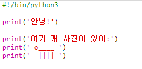

## ASCII art

단순한 문자열보다 훨씬 더 재밌는것을 표현 해 봐요: 바로 ASCII 아트 입니다! ASCII 아트 (*아스키*라고 발음합니다) 는 **문자열로 나타내는 그림**을 만드는 것입니다.

+ 프로그램에 그림을 추가 해 봅시다 - 강아지 그림을 말이죠!
    
    

강아지의 다리는 키보드에서 <kbd>Shift + \</kbd>를 눌러서 입력할 수 있는 파이프 캐릭터 `|`로 만들어집니다.

+ **실행**을 클릭하면, 새 코드에 버그가 있는것을 확인 할 수 있습니다.
    
    
    
    이유는 당신의 문자열에 작은따옴표 `'`가 있기 때문이에요. 파이썬은 이것을 문자열의 끝이라고 생각합니다!
    
    

+ To fix this, just put a backslash `` before the apostrophe in the word `here's`. This tells Python that the apostrophe is part of the text.
    
    

+ If you prefer, you can use three apostrophe `'''` instead of one, which allows you to print multiple lines of text with one `print` statement:
    
    