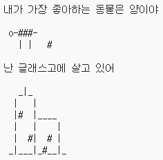

\--- challenge \---

## Challenge: about yourself

Write a Python program to tell others about yourself using text and ASCII art. 당신의 취미나 친구들, 혹은 좋아하는 어떤것이라도 이미지로 만들어 볼 수 있겠죠!

**Trinket에 작성한 코드는 공개된다는 사실을 기억하세요. 주소나 이름같은 개인 정보는 공유하지 마세요!**

Here’s an example:

\--- /challenge \---