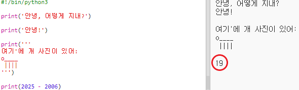
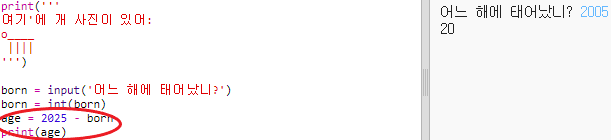

## 2025년

계산하고 숫자를 출력할 수도 있습니다. 2025년에 당신이 몇 살이 될 지 알아봐요!

+ 2025년에 당신이 몇 살이 인지를 계산하려면, 2025에서 태어난 해의 숫자를 빼면 됩니다.
    
    다음 코드를 당신의 프로그램에 추가해 보세요:
    
    
    
    숫자들은 따옴표로 묶을 필요 없습니다. ( 만약 `2006`년에 태어나지 않았다면 숫자를 바꿔야 합니다.)

+ **Run**을 클릭하면, 당신의 프로그램은 2025년에 당신이 몇 살이 인지 출력해줄 겁니다.
    
    

+ `input()`을 사용해 사람들에게 나이를 묻고 그 나이를 **변수** 즉, `born`이라고 불리는 곳에 저장하는 방식으로 프로그램을 더 멋지게 바꿀 수 있습니다.
    
    

+ 프로그램을 실행하고 당신이 태어난 해를 입력해 보세요. 또 다른 에러 메시지가 출력되나요?
    
    입력된 내용은 **텍스트**로 처리되기 때문입니다. 이것은 **숫자**로 바꿔야 합니다.
    
    `int()`를 사용해서 텍스트를 **정수**로 바꿀 수 있습니다. Integer는 정수를 뜻합니다.
    
    

+ 당신의 계산 결과를 저장할 새로운 변수를 만들고, 그 변수를 대신 출력할 수도 있습니다.
    
    

+ 마지막으로, 도움이 될 만한 메세지를 추가해서 프로그램을 이해하기 쉽게 만들 수 있습니다.
    
    