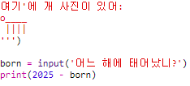
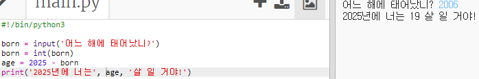

## 2025 년

계산을 하고 숫자를 출력할수도 있습니다. 2025년에 몇살이 될지 한번 알아보죠!

+ 2025년에 당신이 몇살이 될지를 계산하려면, 2025에서 태어난 해의 숫자를 빼면 됩니다.
    
    다음 코드를 당신의 프로그램에 추가 해 보세요:
    
    
    
    숫자들을 따옴표로 묶을 필요는 없습니다. ( 만약 `2006`년에 태어나지 않았다면 숫자를 바꿔야 합니다. )

+ **실행**을 클릭하면, 당신의 프로그램은 2025년에 당신이 몇살이 될지 출력 해 줘야 합니다.
    
    

+ `input()`을 사용 해 사람들에게 나이를 묻고 그 나이를 `born`이라는 **변수**에 저장하는 방식으로 프로그램을 좀 더 멋지게 바꿀수도 있습니다.
    
    

+ 프로그램을 실행하고 당신이 태어난 해를 입력 해 보세요. 다른 오류 메세지가 나오나요?
    
    왜냐면 입력 된 내용은 **문자열**로 처리되기 때문입니다. 이걸 **숫자**로 바꿔야 합니다.
    
    `int()`구문을 사용해서 문자열을 **정수**로 바꿀 수 있습니다. 정수(integer)는 자연수를 뜻합니다.
    
    

+ 당신의 계산 결과를 저장할 새로운 변수를 만들고, 그 변수를 출력할 수도 있습니다.
    
    

+ 마지막으로, 도움이 될 만한 메세지를 추가해서 프로그램을 이해하기 쉽게 만들 수 있습니다.
    
    