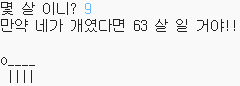

\--- challenge \---

## 도전과제: 개 나이로 치면 몇살?

사람들에게 나이를 묻고, 개 나이로 했을 때 몇살인지 알려주는 프로그램을 만들어 봐요! 사람 나이를 개 나이로 바꾸려면 사람 나이에 7을 곱하면 됩니다.

프로그래밍에서, **곱셈**기호는 `*` 문자입니다. 키보드에서 <kbd>Shift + 8</kbd>을 눌러서 입력 할 수 있어요.

\--- /challenge \---