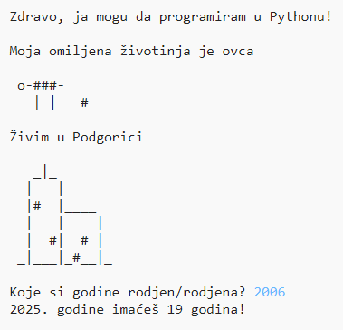

## Uvod

U ovom projektu naučićeš kako da napišeš program u Pythonu u kojem ćeš drugima reći nešto o sebi.

### Šta ćeš napraviti

  <iframe src="https://trinket.io/embed/python/a1f663ae0d?outputOnly=true&start=result" width="600" height="500" frameborder="0" marginwidth="0" marginheight="0" allowfullscreen>
  </iframe>
  

### Šta ćeš naučiti

Ovim projektom obuhvaćeni su elementi iz sljedećih dijelova [Raspberry Pi Digital Making Curriculum](http://rpf.io/curriculum){:target="_blank"}:

+ [Koristite osnovne programske konstrukcije za kreiranje jednostavnih programa](https://www.raspberrypi.org/curriculum/programming/creator){:target="_blank"}

### Dodatne informacije za nastavnike

Ukoliko je potrebno da odštampate ovaj projekat, koristite [verziju za štampu](https://projects.raspberrypi.org/en/projects/about-me/print){:target="_blank"}.

Koristite link koji se nalazi u podnožju stranice da pristupite GitHub repozitorijumu za ovaj projekat, koji sadrži sve izvore (uključujući primjer završenog projekta) u 'en/resources' folderu.