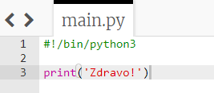
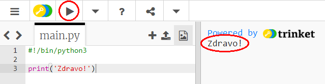
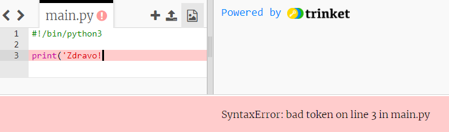
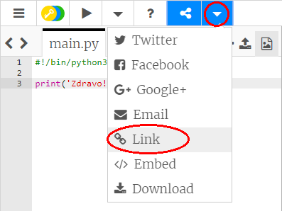

## Reci zdravo

Počnimo sa upisivanjem nekog teksta.

+ Otvori prazan Python šablon u trinketu: <a href="http://jumpto.cc/python-new" target="_blank">jumpto.cc/python-new</a>.

+ U prozor koji se pojavio upiši sljedeće:
    
    
    
    Red `#!/bin/python3` daje do znanja Trinketu da koristimo Python 3 (posljednju verziju).

+ Klikni na **Run** i vidjećeš da naredba `print()` ispisuje sve što se nalazi između navodnika `''`.
    
    

Ako napraviš grešku, dobićeš poruku o grešci koja će te obavijestiti u čemu je problem!

+ Probaj! Izbriši znak izvoda `'` ili zatvorenu zagradu `)` (ili oboje) i pogledaj šta će se desiti.
    
    

+ Ponovo upiši znak izvoda ili zagradu, a zatim klikni na **Run** da provjeriš da li tvoj projekat opet funkcioniše.

**Nije ti potreban Trinket nalog da sačuvaš svoje projekte!**

Ako nemaš Trinket nalog, klikni na strelicu nadolje, a zatim klikni na **Link**. Dobićeš link koji možeš sačuvati i vratititi se na njega kasnije. Biće potrebno da to uradiš svaki put kada napraviš izmjene, pošto će se i link promijeniti!

Ako imaš Trinket nalog, možeš da klikneš na **Remix** da sačuvaš svoju kopiju trinketa.

