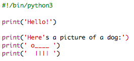

## ASCII umjetnost

Ispišimo nešto mnogo zabavnije od teksta: ASCII umjetnost! ASCII umjetnost (izgovara se '*aski*') stvara **slike od teksta**.

+ Dodajmo malo umjetnosti u tvoj program — sliku psa!
    
    

Noge psa prave se pomoću vertikalne crte `|` koju možeš da upišeš tako što ćeš pritisnuti <kbd>Shift + \ </kbd>.

+ Ako klikneš na **Run**, vidjećeš da postoji greška u tvom novom kôdu.
    
    
    
    To je zato što tvoj tekst sadrži apostrof `'` za koji Python misli da je kraj teksta!
    
    

+ Da to popraviš, samo dodaj obrnutu kosu crtu `` prije apostrofa koji predstavlja rep psa `'`. Tako će Python znati da je apostrof dio teksta.
    
    

+ Ako želiš, možeš da upotrijebiš tri apostrofa `'''` umjesto jednog, pa ćeš moći da ispišeš više redova teksta sa samo jednom `print` naredbom:
    
    