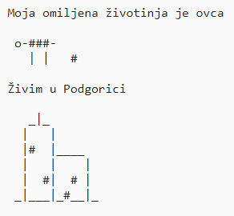

\--- challenge \---

## Izazov: o tebi

Napiši program u Pythonu u kojem ćeš drugima reći nešto o sebi koristeći tekst i ASCII umjetnost. Možeš da napraviš slike svojih hobija, prijatelja ili čega god želiš!

**Ne zaboravi da je kôd koji pišeš u Trinketu javan. Nemoj podijeliti nikakve lične informacije kao, na primjer, svoje puno ime i prezime ili adresu!**

Evo primjera:

\--- /challenge \---