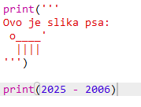
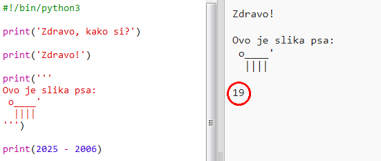
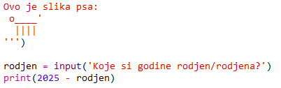
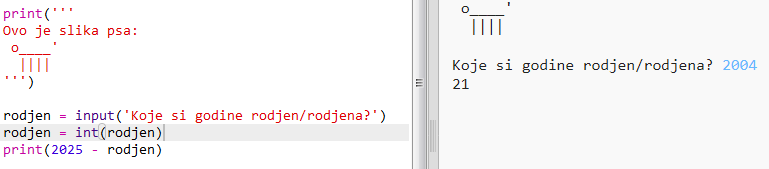
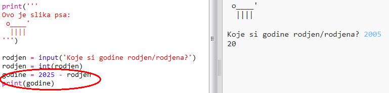
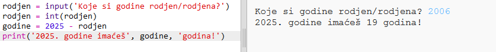

## 2025. godina

Možeš i da računaš i ispisuješ brojeve. Saznajmo koliko godina ćeš imati 2025. godine!

+ Da bi izračunao/izračunala koliko godina ćeš imati 2025. godine, treba da oduzmeš godinu svog rođenja od 2025.
    
    Dodaj ovaj kôd u svoj program:
    
    
    
    Imaj u vidu da brojeve ne treba da stavljaš između navodnika. (Treba da promijeniš broj `2006` ako si rođen/rođena neke druge godine.)

+ Klikni na **Run** i trebalo bi da tvoj program ispiše koliko godina ćeš imati 2025. godine.
    
    

+ Svoj program možeš poboljšati tako što ćeš koristiti `input()` da pitaš korisnika koliko ima godina i sačuvaš odgovor u **promjenljivoj** pod nazivom `rođen`.
    
    

+ Pokreni program i unesi godinu svog rođenja. Da li si dobio/dobila još jednu poruku o grešci?
    
    To se desilo zbog toga što je sve što upišeš u svoj program **tekst** koji treba pretvoriti u **broj**.
    
    Možeš da koristiš `int()` da pretvoriš tekst u **integer**. 'Integer' je cijeli broj.
    
    

+ Možeš i da kreiraš novu promjenljivu za čuvanje svog rezultata, a zatim da nju ispišeš.
    
    

+ Na kraju, možeš napraviti da tvoj program bude razumljiviji tako što ćeš dodati korisnu poruku.
    
    