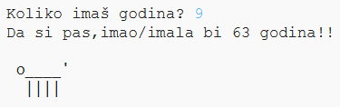

\--- challenge \---

## Izazov: koliko imaš psećih godina?

Napiši program koji pita korisnika koliko godina ima, a zatim mu kaže koliko je to psećih godina! Možeš izračunati koliko psećih godina ima neka osoba tako što ćeš pomnožiti godine te osobe sa 7.

U programiranju je simbol za **množenje** znak `*` koji obično možemo da upišemo ako pritisnemo <kbd>Shift i +</kbd> na tastaturi.

\--- /challenge \---