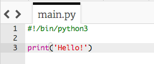
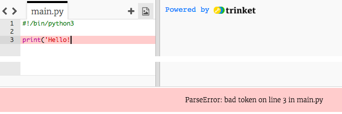

## नमस्कार बोलणे

चला काही मजकूर लिहून प्रारंभ करूया.

+ रिकामा Python Trinket टेंप्लेट उघडा: <a href="http://jumpto.cc/python-new" target="_blank">jumpto.cc/python-new</a>.

+ दिसत असलेल्या विंडोमध्ये खालील टाइप करा:
    
    
    
    `#!/bin/python3` ही ओळ Trinket ला फक्त सांगते की आम्ही Python 3 (नवीनतम आवृत्ती) वापरत आहोत.

+ **Run** क्लिक करा, आणि आपण हे पहातो की `print()` कमांड `''` कोट मार्क दरम्यान प्रत्येक गोष्ट प्रिंट करते.
    
    

आपण चुकल्यास, काय चूक झाली हे सांगताना आपल्याला एक error message मिळेल!

+ करून पाहा! शेवटचा कोट `'` किंवा क्लोजिंग ब्रॅकेट `)` (किंवा दोन्ही) हटवा आणि काय होते ते पहा.
    
    

+ पुन्हा कोट किंवा कंस जोडा आणि **Run** क्लिक करा आपला प्रकल्प पुन्हा कार्य करेल याची खात्री करण्यासाठी.

**तुमचे प्रकल्प सेव्ह करण्यासाठी तुम्हाला Trinket खातं असण्याची गरज नाही!**

तुमचं Trinket खातं नसेल तर, down बाणावर क्लिक करून **Link** वर क्लिक करा. यातून आपल्याला एक लिंक मिळेल ज्याचा वापर करून तुम्ही तिथे नंतर परत जाऊ शकता. लिंक बदलल्यामुळे तुम्ही जेव्हा प्रकल्पात बदल कराल तेव्हा तुम्हाला प्रत्येक वेळी या पद्धतीने नवीन लिंक तयार करून त्याचा वापर करावा लागेल!

आपल्याकडे Trinket खाते असल्यास आपण **Remix** क्लिक करू शकता trinket ची स्वतःची कॉपी जतन करण्यासाठी.

