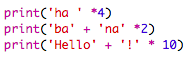

\--- challenge \---

## आव्हान: मजकूराची गणना करणे

आपणास माहित आहे की आपण मजकूराची गणना देखील करू शकता?!

पुढील प्रोग्राम स्क्रीनवर काय print करेल? प्रोग्राम चालू करण्यापूर्वी आपण त्याचा योग्य अंदाज लावू शकता का ते पहा.

आपण स्वतःचे कोणतेही शब्द तयार करू शकता? आपण आपल्या स्वत: च्या नमुने देखील बनवू शकता!

\--- /challenge \---