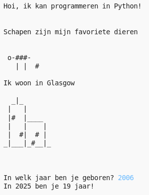

## Inleiding

In dit project leer je een Python-programma te schrijven waarin je alles over jezelf vertelt.

### Wat je gaat maken

  <iframe src="https://trinket.io/embed/python/d6abb9c030?outputOnly=true" width="100%" height="356" frameborder="0" marginwidth="0" marginheight="0" allowfullscreen>
  </iframe>
  

### Wat je gaat leren

Dit project behandelt elementen uit de volgende onderdelen van het [ Raspberry Pi Digital Making Curriculum ](http://rpf.io/curriculum)"}:

+ [ Gebruik eenvoudige programmeerconstructies om eenvoudige programma's te maken ](https://www.raspberrypi.org/curriculum/programming/creator) {:target="_ blank"}

### Aanvullende informatie voor docenten

Als je dit project wilt afdrukken, gebruik dan de [ printvriendelijke versie ](https://projects.raspberrypi.org/en/projects/about-me/print) {:target="_ blank"}.

Gebruik de link in de voettekst voor toegang tot de GitHub opslagplaats voor dit project, met daarin alle bronnen (inclusief een voorbeeld van een voltooid project) in de map ' en/resources'.
