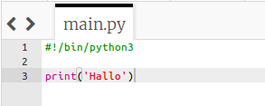
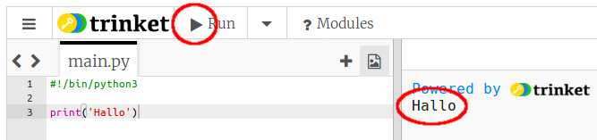
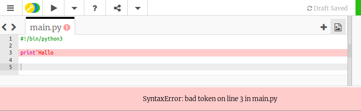
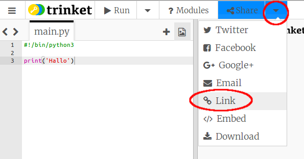

## Hallo zeggen

Laten we beginnen met het schrijven van wat tekst.

+ Open het nieuwe Python-sjabloon in Trinket: <a href="http://jumpto.cc/python-new" target="_blank"> jumpto.cc/python-new </a>.

+ Typ het volgende in het venster dat verschijnt:
    
    
    
    De regel ` #! / Bin / python3 ` vertelt Trinket dat we Python 3 gebruiken (de nieuwste versie).

+ Klik op ** Run ** en je zou moeten zien dat de ` print () ` opdracht alles afdrukt wat tussen de aanhalingstekens ` '' ` staat.
    
    

Als je een fout hebt gemaakt, krijg je een foutmelding waarin staat wat er fout is gegaan!

+ Probeer het! Verwijder het laatste aanhalingsteken `'` of het sluithaakje `)` (of allebei) en kijk wat er gebeurt.
    
    

+ Voeg het aanhalingsteken of het haakje weer toe en klik op ** Run ** om ervoor te zorgen dat je project weer werkt.

**Je hebt geen Trinket-account nodig om je projecten op te slaan!**

Als je geen Trinket-account hebt, klik dan op de pijl-omlaag en vervolgens op ** Link **. This will give you a link that you can save and come back to later. You'll need to do this every time you make changes, as the link will change!

If you have a Trinket account, you can click **Remix** to save your own copy of the trinket.

