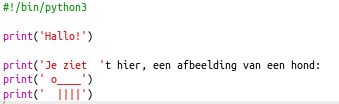

## ASCII-kunst

Laten we iets leukers printen dan alleen tekst: ASCII-kunst! ASCII-kunst (uitgesproken als '* ask-ie * ') is het maken van ** afbeeldingen van tekst **.

+ Voeg wat kunst toe aan je programma - een afbeelding van een hond!
    
    

De poten van de hond zijn gemaakt met behulp van het sluisteken ` | ` (Engels: pipe) die je kunt typen door op <kbd> Shift + \ te drukken </kbd> op de meeste UK/US toetsenborden.

+ Als je op ** Run **klikt zul je zien dat er een fout in je nieuwe code zit.
    
    
    
    Dat komt omdat er in de tekst een apostrof ` ' ` zit, waardoor Python denkt dat dit het einde van de tekst is!
    
    

+ Om dit te herstellen zet je een schuine streep ` \ ` voor de apostrof in het woord ` here' s `. Dit vertelt Python dat de apostrof deel uitmaakt van de tekst.
    
    

+ Als je wilt, kunt je drie apostrofs gebruiken ` ''' ` in plaats van één, waardoor je meerdere regels tekst kunt afdrukken met één ` print ` instructie:
    
    