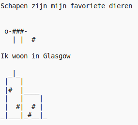

\--- challenge \---

## Challenge: over jezelf

Schrijf een Python-programma om iets over jezelf te vertellen met behulp van tekst en ASCII-kunst. Je kunt afbeeldingen maken van je hobby's, vrienden of wat je maar wilt!

**Vergeet niet dat de code die je in Trinket schrijft openbaar is. Deel geen persoonlijke gegevens zoals je volledige naam of adres!**

Hier is een voorbeeld:

\--- /challenge \---