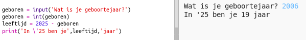

## Het jaar 2025

U kunt ook berekeningen maken en nummers afdrukken. Laten we eens kijken hoe oud je bent in het jaar 2025!

+ Om te berekenen hoe oud je bent in het jaar 2025, moet je jouw geboortejaar van 2025 aftrekken.
    
    Voeg deze code toe aan je programma:
    
    
    
    Je ziet dat er geen aanhalingstekens om cijfers hoeven te staan. (Je moet het nummer ` 2006 ` veranderen als je in een ander jaar bent geboren.)

+ Klik op ** Run ** en het programma zou je leeftijd in het jaar 2025 moeten laten zien.
    
    

+ Je kunt het programma verbeteren door met ` invoer () ` de gebruiker zijn / haar leeftijd te vragen en die op te slaan in een ** variabele ** met de naam ` geboren `.
    
    

+ Run het programma en voer je geboortejaar in. Heb je nog een foutmelding gekregen?
    
    Dat komt omdat alles wat je in je programma typt ** tekst ** is. En dat moet worden omgezet naar een ** getal **.
    
    Je kunt ` int () gebruiken ` om de tekst om te zetten naar een ** integer**. Een integer is een geheel getal.
    
    

+ Je kunt ook een andere variabele maken om de berekening op te slaan en die af te drukken.
    
    

+ Tenslotte kan het programma gemakkelijker te begrijpen worden gemaakt, door er een handig bericht aan toe te voegen.
    
    