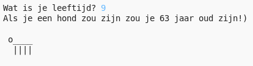

--- challenge ---

## Uitdaging: je leeftijd in hondenjaren

Schrijf een programma die de gebruiker vraagt naar zijn of haar leeftijd en geef dan de leeftijd in hondenjaren! Je kunt de leeftijd in hondenjaren berekenen door zijn of haar leeftijd te vermenigvuldigen met 7.

Bij het programmeren is het symbool voor **vermenigvuldiging** het `*` teken dat je meestal krijgt door `Shift + 8` te typen.

--- /challenge ---
