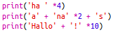
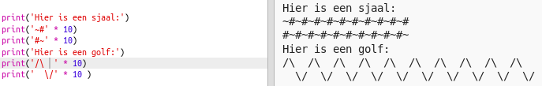

--- challenge ---

## Uitdaging: rekenen met tekst

Wist je dat je ook met tekst kunt rekenen?

Wat zal het volgende programma op het scherm laten zien? Kijk of je het kunt raden voordat je het programma start.

Kun je zelf woorden bedenken? Je kunt zelfs je eigen patronen maken!

--- /challenge ---
***

### Door de community geleverde vertaling

Dit project werd vertaald door **Henny van Ham** en gecontroleerd door **Cor Groot**.

Onze geweldige vertalers helpen ons om kinderen over de hele wereld de kans te geven te leren coderen. Jij kunt ons helpen nog meer kinderen te bereiken door onze projecten te vertalen - lees meer op [rpf.io/translators](https://rpf.io/translators).
