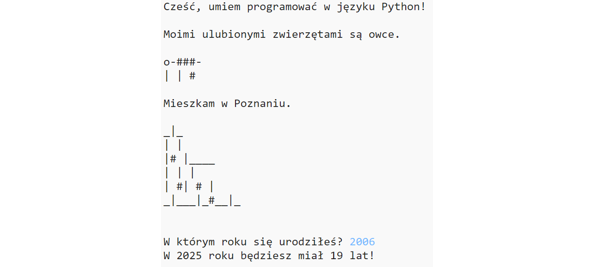

## Wprowadzenie

Wykonując ten projekt nauczysz się, jak napisać w języku Python program, który opowiada innym o tobie.

### Co stworzysz

  <iframe src="https://trinket.io/embed/python/15f7de7e4d?outputOnly=true" width="100%" height="356" frameborder="0" marginwidth="0" marginheight="0" allowfullscreen></iframe>
  

### Czego się nauczysz

Ten projekt pokrywa elementy z następujących wątków z [Raspberry Pi Digital Making Curriculum](http://rpf.io/curriculum){:target="_blank"}:

+ [Użycie podstawowych konstrukcji programistycznych do tworzenia prostych programów](https://www.raspberrypi.org/curriculum/programming/creator){:target="_blank"}

### Dodatkowe informacje dla nauczycieli

Jeśli chcesz wydrukować ten projekt, użyj [wersji do druku](https://projects.raspberrypi.org/en/projects/about-me/print){:target="_blank"}.

Skorzystaj z odnośnika w stopce, aby uzyskać dostęp do repozytorium kodu tego projektu w serwisie GitHub. Repozytorium to zawiera wszystkie zasoby (w tym przykład gotowego projektu) w folderze 'pl-PL/resources'.
