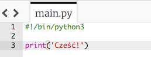
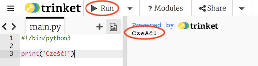
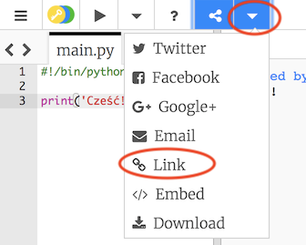

## Mówimy "cześć"

Zacznijmy od napisania jakiegoś tekstu.

+ Otwórz pusty szablon dla języka Python w edytorze trinket: <a href="http://jumpto.cc/python-new" target="_blank">jumpto.cc/python-new</a>.

+ W okienku po lewej stronie wpisz poniższy kod:
    
    
    
    Linia `#!/bin/python3` informuje edytor Trinket, że używamy języka Python 3 (najnowszej wersji).

+ Kliknij **Run** a zobaczysz, że polecenie `print()` wyświetla wszystko, co jest zapisane pomiędzy apostrofami `''`.
    
    

Jeśli popełnisz błąd, otrzymasz komunikat w języku angielskim o błędzie z informacją, co poszło nie tak!

+ Spróbuj! Usuń ostatni apostrof `'` albo nawias zamykający `)` (albo oba) i zobacz, co się stanie.
    
    

+ Dodaj z powrotem apostrof albo nawias i kliknij **Run**, aby upewnić się, że projekt znowu działa.

**Nie potrzebujesz konta w Trinket, aby zapisać swoje projekty!**

Jeśli nie masz konta Trinket, kliknij strzałkę w dół, a następnie kliknij **Link**. Zobaczysz link, który możesz zapisać i użyć później, aby wrócić do swojego projektu. Musisz to robić za każdym razem, gdy wprowadzisz zmiany, ponieważ link będzie się zmieniał!

Jeśli masz konto w Trinket, możesz kliknąć **Remix**, aby zapisać własną kopię projektu.

