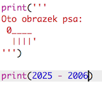
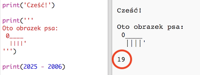
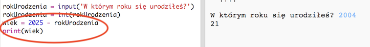
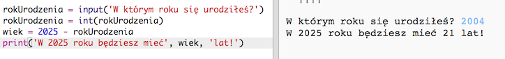

## Rok 2025

Możesz też wykonywać obliczenia i wyświetlać liczby. Sprawdźmy, ile będziesz mieć lat w 2025 roku!

+ Aby obliczyć, ile będziesz miał lat w 2025 roku, musisz od 2025 odjąć swój rok urodzenia.
    
    Dodaj ten kod do swojego programu:
    
    
    
    Zauważ, że nie musisz umieszczać apostrofów wokół liczb. (Musisz zmienić liczbę `2006`, jeśli urodziłeś się w innym roku.)

+ Kliknij **Run**, a Twój program powinien wyświetlić Twój wiek w 2025 roku.
    
    

+ Możesz ulepszyć swój program używając polecenia `input()`, aby zapytać użytkownika o jego wiek i zapisać go w **zmiennej** o nazwie `rokUrodzenia`.
    
    

+ Uruchm program, a następnie wpisz swój rok urodzenia. Pojawił się kolejny komunikat o błędzie?
    
    Dzieje się tak dlatego, że wszystko, co wpisujesz w swoim programie, to **tekst**, który musi zostać przekonwertowany na **liczbę**.
    
    Możesz użyć `int()`, aby przekonwertować tekst na **liczbę całkowitą** (ang. *integer*). 
    
    

+ Możesz także utworzyć kolejną zmienną do przechowywania wyniku obliczeń i wyświetlić ją.
    
    

+ Możesz też sprawić, że program będzie bardziej zrozumiały, dodając odpowiedni komunikat.
    
    