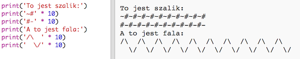

\--- challenge \---

## Wyzwanie: obliczanie tekstu

Czy wiesz, że możesz również wykonywać obliczenia na tekstach?!

Co poniższy program wyświetli na ekranie? Spróbuj zgadnąć zanim uruchomisz program.

Możesz wymyślić jakieś własne słowa? Możesz nawet tworzyć własne wzory!

\--- /challenge \---