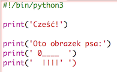
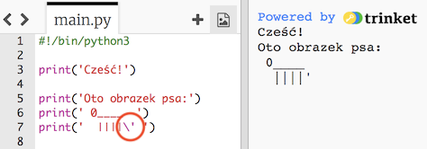

## ASCII art

Wyświetlmy coś znacznie fajniejszego niż tekst: ASCII art! ASCII art (wymawiane jak "*aski*") to tworzenie **obrazów za pomocą tekstu**.

+ Dodajmy do programu trochę sztuki - obrazek psa!
    
    

Nogi psa są wykonane przy użyciu tzw. znaku potoku `|`, który możesz wpisać naciskając <kbd>Shift + \</kbd> na większości polskich klawiatur.

+ Kiedy klikniesz przycisk **Run** zobaczysz, że w twoim nowym kodzie jest błąd.
    
    
    
    To dlatego, że twój tekst zawiera apostrof `'`, więc Python myśli, że to koniec tekstu!
    
    

+ Aby to naprawić, umieść po prostu lewy ukośnik `` przed apostrofem, czyli ogonem psa. Dzięki temu Python wie, że ten apostrof to część tekstu.
    
    

+ Jeśli wolisz, możesz użyć trzech apostrofów `'''` zamiast jednego. Pozwala to na wyświetlenie wielu linii tekstu przy użyciu jednego polecenia `print`:
    
    