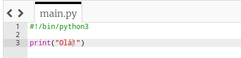
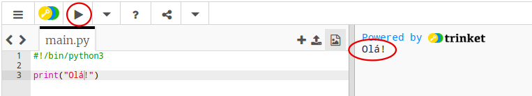
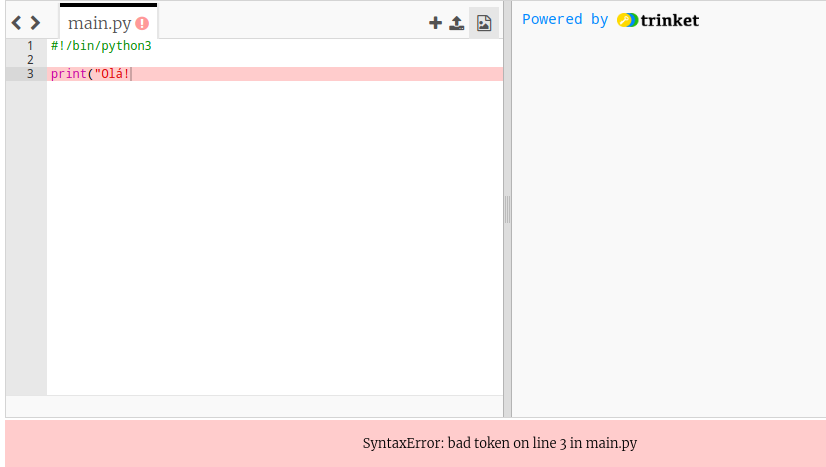
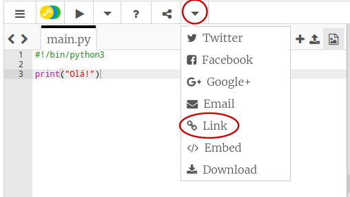

## Dizer olá

Vamos começar escrevendo algum texto.

+ Abra um modelo Python em branco no trinket: <a href="http://jumpto.cc/python-new" target="_blank">jumpto.cc/python-new</a>.

+ Digite o seguinte na janela que aparece:
    
    
    
    A linha `#!/bin/python3` apenas informa ao Trinket que estamos usando o Python 3 (a última versão).

+ Clique em **Run**, e você verá que o comando `print()` imprime tudo entre as aspas `''`.
    
    

Se você cometeu um erro, receberá uma mensagem de erro informando o que aconteceu de errado!

+ Tente! Apague a aspa final `'` ou o parêntese de fechamento `)` (ou ambos) e veja o que acontece.
    
    

+ Adicione a aspa ou o parêntese de volta e clique em **Run** para garantir que seu projeto funcione novamente.

**Você não precisa de uma conta no Trinket para salvar seus projetos!**

Se você não tiver uma conta no Trinket, clique na seta para baixo e, em seguida, clique em **Link**. Isso lhe dará um link que você pode salvar e voltar mais tarde. Você precisará fazer isso toda vez que fizer mudanças, pois o link mudará!

Se você tem uma conta no Trinket, você pode clicar em **Remix** para salvar sua própria cópia do trinket.

