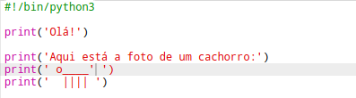
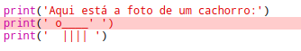
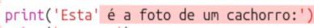
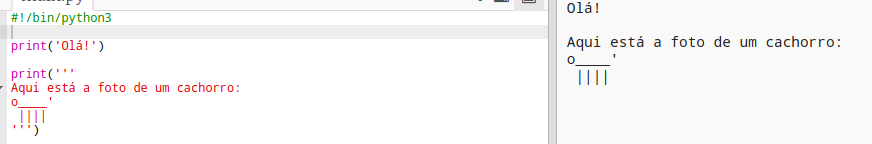

## Arte ASCII

Vamos imprimir algo muito mais divertido do que texto: arte ASCII! A arte ASCII (pronuncia-se '*ask-e*') está criando **imagens fora do texto**.

+ Vamos adicionar um pouco de arte ao seu programa - uma foto de um cachorro!
    
    

As pernas do cachorro são feitas usando o personagem pipe `|` que você pode digitar pressionando <kbd>Shift + \ </kbd> na maioria dos teclados do Reino Unido / EUA em inglês.

+ Se você clicar em **Run**, verá que há um bug no seu novo código.
    
    
    
    Isso porque seu texto contém um apóstrofo `'`, que o Python considera o fim do texto!
    
    

+ Para corrigir isso, basta colocar uma barra invertida `` antes do apóstrofo na palavra `aqui`. Isso informa ao Python que o apóstrofo é parte do texto.
    
    

+ If you prefer, you can use three apostrophes `'''` instead of one, which allows you to print multiple lines of text with one `print` statement:
    
    