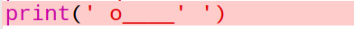
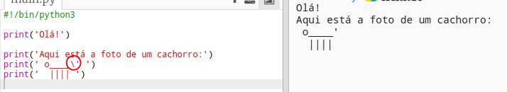

## Arte ASCII

Vamos imprimir algo muito mais divertido do que texto: arte ASCII! A arte ASCII (pronuncia-se '*ask-e*') é a criação de **imagens a partir de texto**.

+ Vamos adicionar um pouco de arte ao seu programa - uma foto de um cachorro!
    
    

As pernas do cachorro são feitas usando o caractere pipe `|` que você pode digitar pressionando <kbd>Shift + \ </kbd> na maioria dos teclados em português.

+ Se você clicar em **Run**, verá que há um bug no seu novo código.
    
    
    
    Isso porque o corpo do cachorro contém uma aspa `'` para formar o rabo, que o Python considera o fim do texto!
    
    

+ Para corrigir isso, basta colocar uma barra invertida `` antes da aspa que forma o rabo do cachorro `o____'`. Isso informa ao Python que a aspa é parte do texto.
    
    

+ Se preferir você pode usar três aspas simples `'''` ao invés de uma, o que permite imprimir várias linhas de texto com uma instrução `print`:
    
    