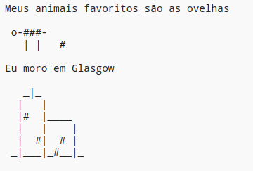

\--- desafio \---

## Desafio: sobre você

Escreva um programa em Python para contar aos outros sobre você usando texto e arte ASCII. Você pode criar imagens de seus hobbies, amigos ou qualquer coisa que você gosta!

**Lembre-se que o código que você escreve no Trinket é público. Não compartilhe informações pessoais, como seu nome completo ou endereço!**

Aqui está um exemplo:

\--- / desafio \---