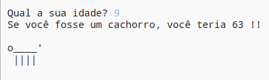

\--- desafio \---

## Desafio: sua idade em anos de cachorro

Escreva um programa para perguntar ao usuário sua idade e, em seguida, diga a ele sua idade em anos de cachorro! Você pode calcular a idade de uma pessoa em anos de cachorro multiplicando sua idade por 7.

Na programação, o símbolo para a multiplicação ** ** é o ` * ` caractere, que você normalmente pode digitar pressionando <kbd> Shift + 8 </kbd> no teclado.

\--- / desafio \---