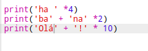

\--- desafio \---

## Desafio: calcular o texto

Você sabia que você também pode calcular o texto?

O que o programa a seguir imprimirá na tela? Veja se você consegue adivinhá-lo corretamente antes de executar o programa.

Você consegue inventar suas próprias palavras? Você pode até criar seus próprios padrões!

\--- / desafio \---