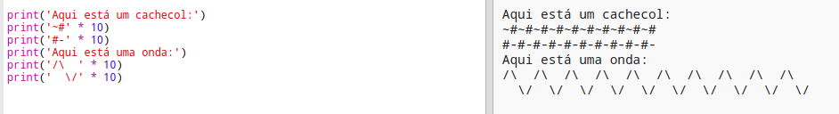

\--- challenge \---

## Desafio: cálculo de texto

Você sabia que também pode calcular texto?!

O que o programa a seguir imprimirá na tela? Veja se você consegue adivinhar corretamente antes de executar o programa.

Você pode inventar suas próprias palavras? Você pode até criar seus próprios padrões!

\--- /challenge \---