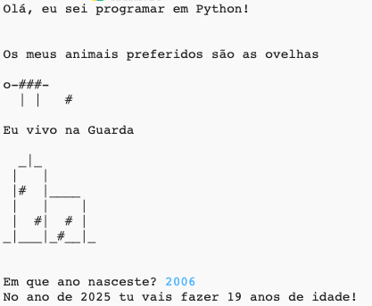

## Introdução

Neste projeto, vais aprender a escrever um programa em Python contando oos outros tudo sobre ti.

### O que vais fazer

  <iframe src="https://trinket.io/embed/python/a1f663ae0d?outputOnly=true&start=result" width="600" height="500" frameborder="0" marginwidth="0" marginheight="0" allowfullscreen>
  </iframe>
  

### O que vais aprender

Este projeto abrange elementos das seguintes vertentes do [Currículo Raspberry Pi Digital Making](http://rpf.io/curriculum){: target = "_ blank"}:

+ [Usar construções básicas de programação para criar programas simples](https://www.raspberrypi.org/curriculum/programming/creator){: target = "_ blank"}

### Informações adicionais para educadores

Se você precisar imprimir este projeto, por favor, use a [versão para impressão](https://projects.raspberrypi.org/en/projects/about-me/print){: target = "_ blank"}.

Use o link no rodapé para acessar o repositório do GitHub para este projeto, que contém todos os recursos (incluindo um exemplo de projeto concluído) na pasta 'en / resources'.