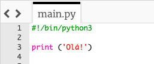
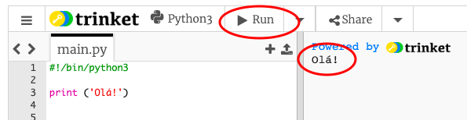
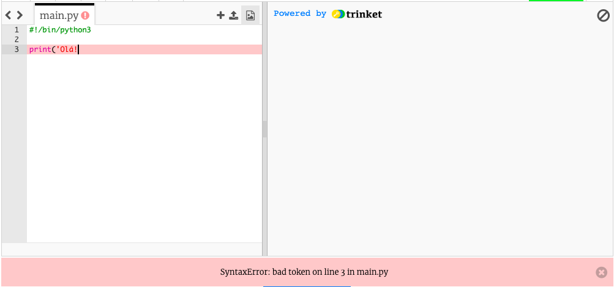
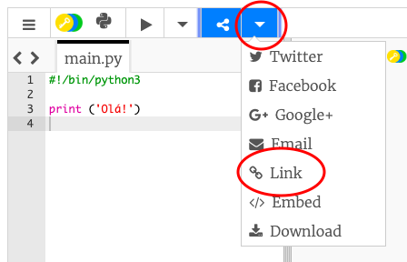

## Dizer olá

Vamos começar por escrever algum texto.

+ Abre o modelo em branco do Python Trinket: <a href="https://trinket.io/python/e944e28e36" target="_blank">https://trinket.io/python/e944e28e36</a>.

+ Digite o seguinte na janela que aparece:
    
    
    
    A linha `#! / Bin / python3` apenas diz ao Trinket que estamos usando o Python 3 (a última versão).

+ Clique em **Run**, e verás que o comando `print ()` imprime tudo o que está entre os apóstrofos `''`.
    
    

Se cometeste um erro, em vez disso recebes uma mensagem de erro a dizer o que correu mal!

+ Tenta! Apaga o apostrofo final `'` ou o parentesis de fechar `)` (ou ambos) e vê o que acontece.
    
    

+ Adiciona o apóstrofo ou o parêntesis de volta e clica em **Run** para garantires que o teu projeto funciona novamente.

**Não precisas de uma conta Trinket para guardar os teus projetos!**

Se não tiveres uma conta do Trinket, clica na seta para baixo e, em seguida, clica em **Link**. Assim vais obter um link que podes guardar e que te permitirá voltar mais tarde ao projeto. Vais precisar de fazer o mesmo de cada vez que fizeres alterações, pois o link vai mudar!

Se tens uma conta Trinket, podes clicar **Remix** para guardar a tua própria cópia do trinket.

