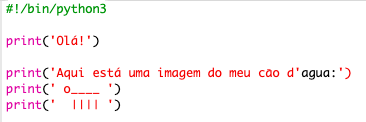
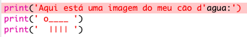
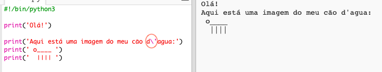
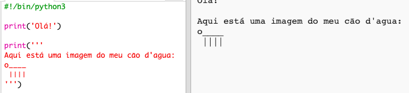

## Arte ASCII

Vamos imprimir algo muito mais divertido do que texto: arte ASCII! A arte ASCII (pronuncia-se '*ask-e*') é criar **imagens a partir de texto**.

+ Vamos adicionar um pouco de arte ao teu programa - uma imagem de um cāo d'água!
    
    

As pernas do cachorro são feitas usando o caratere barra vertical `|` que podes digitar pressionando <kbd>Shift + \ </kbd> na maioria dos teclados UK/US.

+ Se clicares em **Run**, verás que há um bug no teu novo código.
    
    
    
    Isso porque seu texto contém um apóstrofo `'`, que o Python considera o fim do texto!
    
    

+ Para corrigir isso, basta colocar uma barra invertida `` antes do apóstrofo na palavra `d'agua`. Isso diz ao Python que o apóstrofo faz parte do texto.
    
    

+ Se preferires, podes usar três apóstrofos `''' ` em vez de um, o que permite imprimir várias linhas de texto apenas com uma instruçāo de `imprimir`:
    
    