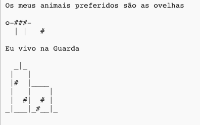

\--- challenge \---

## Desafio: sobre ti

Escreve um programa em Python para informar os outros sobre ti usando texto e arte ASCII. Podes criar imagens dos teus hobbies, amigos ou qualquer coisa que gostes!

**Lembra-te que o código que escreves no Trinket é público. Não compartilhes informações pessoais, como o teu nome completo ou o teu endereço!**

Aqui está um exemplo:

\--- /challenge \---