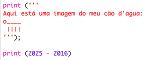
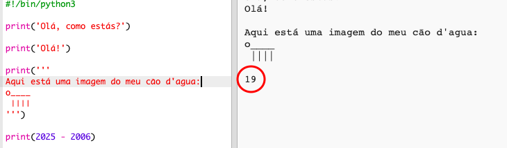
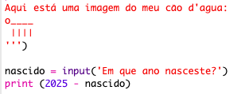
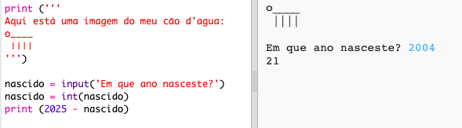
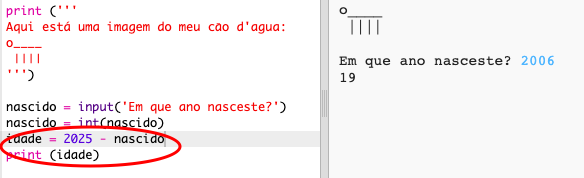
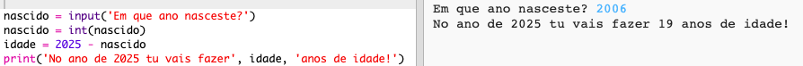

## O ano de 2025

Você também pode fazer cálculos e imprimir números. Vamos descobrir quantos anos você terá no ano 2025!

+ Para calcular quantos anos você terá no ano de 2025, você precisa subtrair o ano em que nasceu a partir de 2025.
    
    Adicione este código ao seu programa:
    
    
    
    Observe que você não precisa colocar aspas nos números. (Você precisará alterar o número `2006` se você nasceu em um ano diferente.)

+ Clique em **Executar**e seu programa deverá imprimir sua idade no ano de 2025.
    
    

+ Você poderia melhorar seu programa usando `input ()` para perguntar ao usuário sua idade e armazená-lo em uma **variável** chamada `nascida`.
    
    

+ Execute o seu programa e, em seguida, insira o ano em que você nasceu. Você conseguiu outro erro messgae?
    
    Isso porque qualquer coisa digitada em seu programa é **texto**e precisa ser convertida em **número**.
    
    Você pode usar `int ()` para converter o texto em um **inteiro**. Um inteiro é um número inteiro.
    
    

+ Você também pode criar outra variável para armazenar seu cálculo e imprimi-la.
    
    

+ Finalmente, você pode tornar seu programa mais fácil de entender, adicionando uma mensagem útil.
    
    