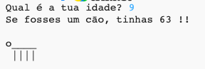

--- challenge ---

## Desafio: a tua idade em anos de cão

Escreve um programa para perguntar ao utilizador a idade e, em seguida, responde com a idade em anos de cachorro! Podes calcular a idade de uma pessoa em anos de cachorro multiplicando a sua idade por 7.

Na programação, o símbolo para a **multiplicação** é o `*`, que normalmente podes digitar pressionando <kbd>Shift + 8</kbd> no teclado.

--- /challenge ---